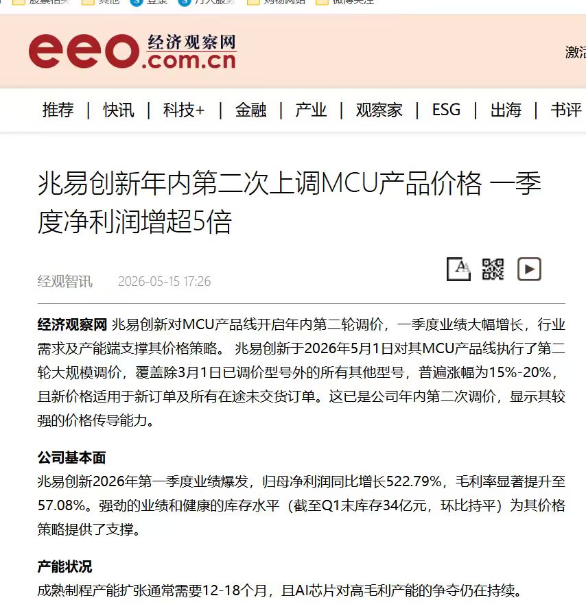
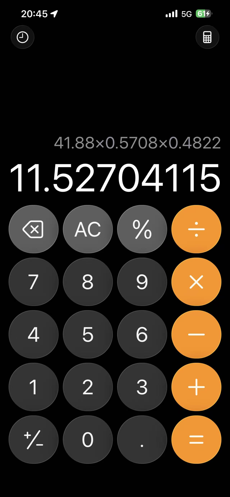
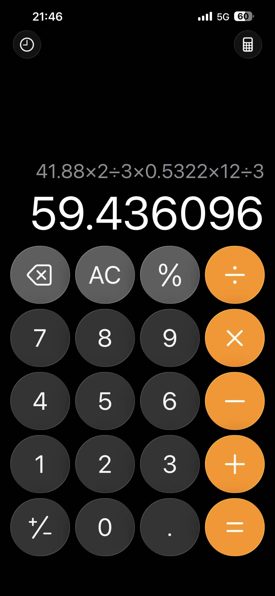
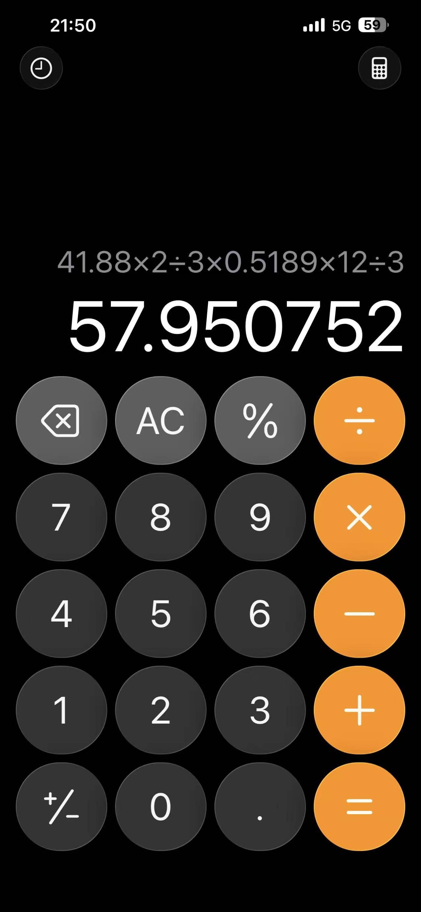
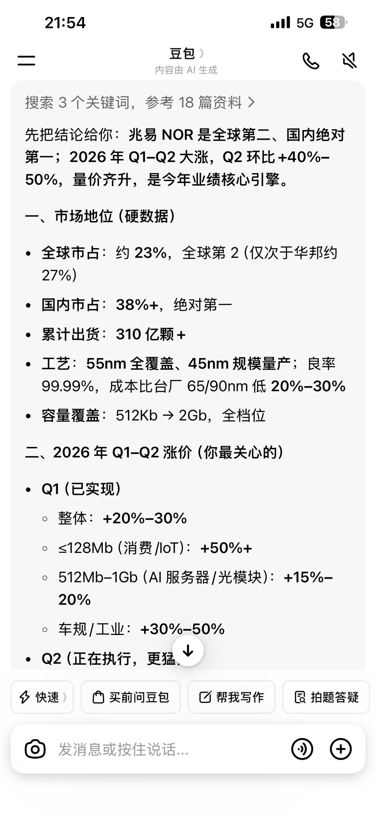
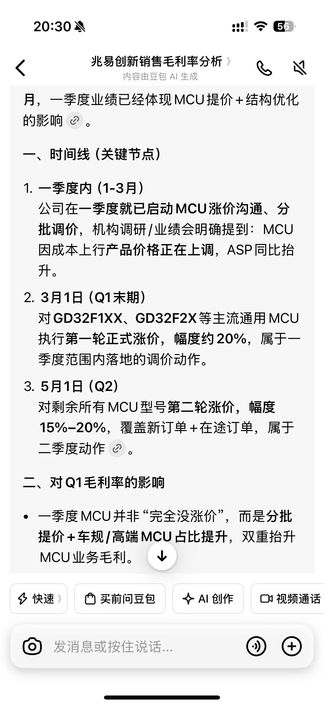
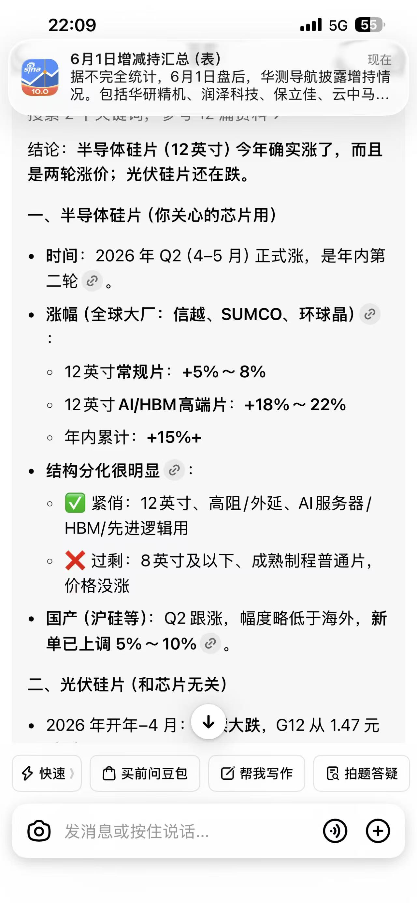
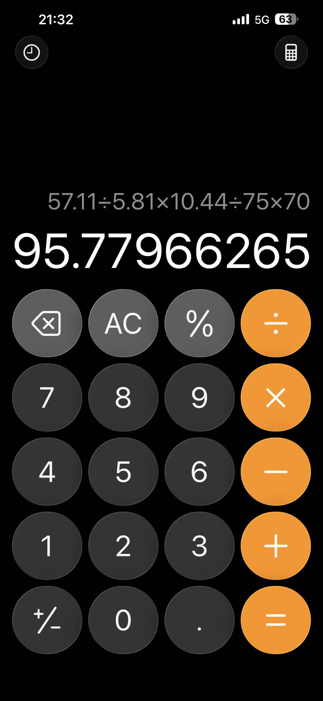
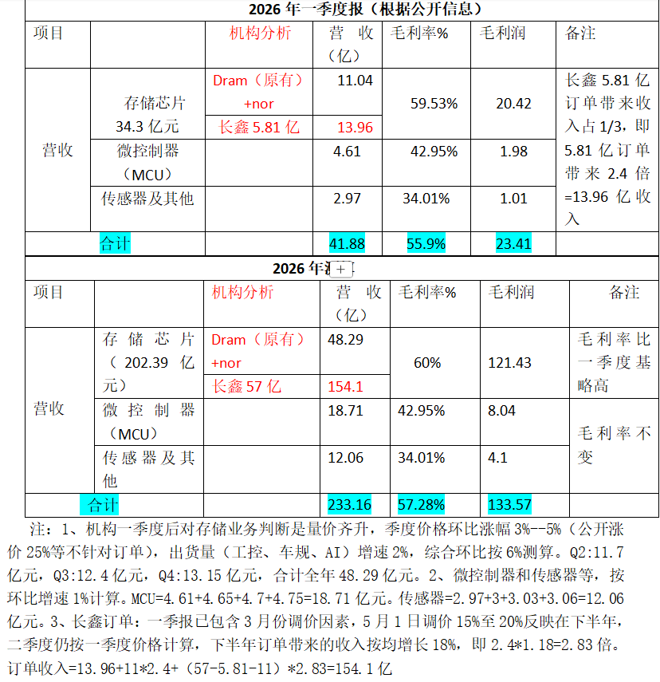
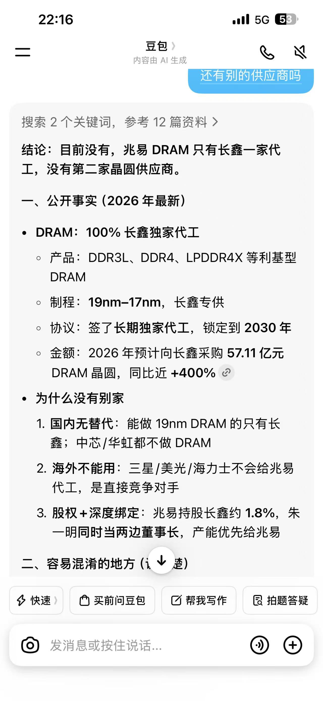

# 兆易创新财务报表计算讨论记录

---

## 参与者

- 快乐的frog（主要分析者）
- 月亮圆鼓鼓
- T T🤗
- 蓝小娜
- 涵之
- 在風里的我

---

## 第一部分：NOR与MCU涨价分析讨论

快乐的frog：按照之前的公式计算都将近80个点了

快乐的frog：虽然一季度dram涨价确实很凶，但是也夸张了

快乐的frog：所以我觉得很可能nor的涨价远超这个值，然后mcu也放量了

快乐的frog：因为在我心目中就应该70上下

快乐的frog：75到天了

快乐的frog：那就是nor肯定涨价不少

快乐的frog：或者mcu车规真的有进度了

快乐的frog：按照8个点来算一下

月亮圆鼓鼓：8个点是以什么基础算的

快乐的frog：但是这就说明一个问题，nor确实长得很凶了

月亮圆鼓鼓：

快乐的frog：但这是五月份的信息啊

快乐的frog：三月份的调价理论上应该有滞后效应

T T🤗：一季度也长了

T T🤗：说第二轮调价了

快乐的frog：那是3月份才调整的啊

快乐的frog：3月份调整了部分型号

快乐的frog：卧槽

快乐的frog：这样的话完犊子了

快乐的frog：2季度又得重新估计

快乐的frog：我没有预计mcu会涨价这么凶啊

快乐的frog：我觉得mcu是相对稳定的

快乐的frog：最多是车规高毛利突破

快乐的frog：但是他直接涨价

快乐的frog：那代表我2季度对于mcu的毛利估计少了

快乐的frog：但不对，他说的是成本增长

快乐的frog：也就是说下游代工厂涨价了

快乐的frog：也就是说20个点里面可能是一边一半

快乐的frog：或者他吃了5个点差价

快乐的frog：那中芯国际爽死了哦

快乐的frog：完了，这样的话要做精算了

快乐的frog：可是那不会影响一季度报表啊

蓝小娜：影响不大

蓝小娜：但是第二季度就大了

快乐的frog：那一季度就是车规放量了？

快乐的frog：这个信息我一直找不到

快乐的frog：捂得太死了

快乐的frog：@吃一个榴莲 车规放量了没啊

快乐的frog：为什么要高调

快乐的frog：偷摸搞动作那么高调干啥

快乐的frog：生怕别人不围剿你？

快乐的frog：当然也是因为我没有参与投资者会议

快乐的frog：我明明是投资者，为啥不邀请我

快乐的frog：我一堆问题啊

快乐的frog：我需要数据做测算啊

快乐的frog：数据不透明对我是个巨大的伤害

快乐的frog：我知道nor和mcu都要涨，尤其是mcu

快乐的frog：因为车规放量比较延后

快乐的frog：但是我预计的是量不是价格啊

涵之：

快乐的frog：看到了吗

快乐的frog：甚至！

快乐的frog：适当的回落！

快乐的frog：就代表大概率这个价格要一直维持！

涵之：是的

---

## 第二部分：毛利率精算与业务拆分分析

快乐的frog：好，先回报表

快乐的frog：我们以后再来补充新信息进行调整

快乐的frog：信息太不透明了不好搞

快乐的frog：他们就是怕我这种人来推算报表，每次都搞的严严实实的

快乐的frog：一点不坦诚

快乐的frog：那先按8个点算

快乐的frog：假设

快乐的frog：这么看来可能不止

快乐的frog：41.88×0.5708×0.4822=11.52704115

快乐的frog：其他部分的毛利

快乐的frog：叫你不好好算报表！

快乐的frog：他们是不懂，你是为啥[白眼][白眼][白眼][白眼]

快乐的frog：41.88×2÷3×0.4822 =13.463 13.463024

快乐的frog：这个

快乐的frog：41.88×0.5708-13.463=10.442104

快乐的frog：这个，dram的

快乐的frog：10.4421×3÷41.88=0.7480014327

在風里的我：这比反推的那个还高

快乐的frog：这就是反推啊

快乐的frog：反推全逻辑啊

在風里的我：咿，那这样，其他业务的毛利率不就是48.2%

在風里的我：我还以为是拿去年第四季度加8%[捂脸]

快乐的frog：按照四季度来算最好，但是我找不到四季度的dram占比

快乐的frog：四季度的毛利率里面已经有了dram

快乐的frog：啊啊啊啊啊啊啊啊

快乐的frog：我需要尽调

快乐的frog：我要看报表

快乐的frog：我受不了了

快乐的frog：这对我是巨大的伤害

快乐的frog：我请求查阅报表

快乐的frog：行使小股东权利

快乐的frog：你不觉得这个洗盘很刻意吗小无

快乐的frog：最近的大盘充满了刻意

在風里的我：如果一季度dram的毛利率是74.8%，叠加涨价，那不得差不多到80，这么夸张的吗

快乐的frog：不不不，长鑫会涨价

快乐的frog：下游会涨价的

快乐的frog：我们平和一点，按照70算吧

快乐的frog：57.11÷5.81×10.44÷75×70=95.77966265

快乐的frog：这是dram

快乐的frog：mcu涨价了

快乐的frog：nor涨价了

快乐的frog：啊啊啊啊啊啊啊啊

快乐的frog：我的信息不够

快乐的frog：这还没算车规突破的高毛利空间

快乐的frog：还没算新样品取代emmc的新空间

快乐的frog：他的mcu也在涨

快乐的frog：他本来就是国产替代的垄断受益啊

快乐的frog：去年mcu占了20%

快乐的frog：假设今年不变

快乐的frog：dram 1/3

快乐的frog：剩下的是nor

蓝小娜：还有一个定制板块，25年送样，26年第一季度仍处于客户验证、逐步量产初期

快乐的frog：slcnand基数太低

蓝小娜：可能第二季度开始就有点利润，虽然量小，但是它利润高

快乐的frog：现在增速再大也抢不过风头

蓝小娜：[奸笑]如果全年来个几亿也是苍蝇腿

快乐的frog：那就当nor占了40

快乐的frog：slcnand占了7

快乐的frog：mcu占了20

快乐的frog：nor涨了15个点，mcu二季度也涨了15个点

快乐的frog：我就当他们的量没有特别差异，维持普遍增速

快乐的frog：取个8，因为今年的收入增速是10

快乐的frog：41.88×2÷3×0.5322×12÷3=59.436096

快乐的frog：没算一季度的进度损失

快乐的frog：假设15个点的增幅有10个点是给下游的

快乐的frog：自己分了5个点

快乐的frog：不对，公式有瑕疵

T T🤗：0.5322是啥

T T🤗：毛利率

快乐的frog：是啊，你们说的涨价了啊

快乐的frog：我分了2/3给下游

快乐的frog：上游吃1/3

快乐的frog：41.88×2÷3×0.5189×12÷3=57.950752

快乐的frog：这个

快乐的frog：我很不愉快

快乐的frog：我缺乏信息支撑

快乐的frog：我需要半年报！

快乐的frog：是除了dram的板块，其他2/3

快乐的frog：综合nor和mcu的涨价信息

快乐的frog：考虑一季度不变

T T🤗：0.5189就是完全属于兆易的，非dram的毛利是吧

快乐的frog：是除了dram以外的

快乐的frog：预计一季度的综合毛利和现在的涨价信息

快乐的frog：nor二季度也要涨了

蓝小娜：我觉得MCU算15%已经很保守了，我扒拉了一下他家的主流系列基本上都是20%涨幅，部分小众/低毛利型号为15%

快乐的frog：不是啊，涨了15个点啊

快乐的frog：

快乐的frog：我保守了

快乐的frog：我不算了

快乐的frog：我躺平了

快乐的frog：怎么nor二季度涨这么凶

快乐的frog：谁能给我具体的细分报表

快乐的frog：我愿意卖身

快乐的frog：卖艺

快乐的frog：只要给我一个报表

T T🤗：这算的一年的啊

快乐的frog：对啊

快乐的frog：不然你吓死了

快乐的frog：这我已经吓死了

T T🤗：[破涕为笑]我还以为再算二季度呢

---

## 第三部分：产业链涨价传导与代工格局分析

蓝小娜：重点是，还在继续涨价

蓝小娜：咱们这个是基于现在的行情

快乐的frog：我只要去年的细分报表就行

蓝小娜：以及出货量

快乐的frog：给我分板块的

快乐的frog：有量价对不的

快乐的frog：你们谁去跟主力聊一聊？

快乐的frog：给我这个

快乐的frog：还有今年的一季报

快乐的frog：

月亮圆鼓鼓：蛙姐，这种毛利率会随着季度变化不

快乐的frog：

快乐的frog：不会…

快乐的frog：会随着供需环境变化

快乐的frog：这是个长周期

月亮圆鼓鼓：除非是原材料导致成本变化吧

快乐的frog：因为兆易做的是2B

快乐的frog：我算了15的平均增幅

快乐的frog：但是分了2/3给上游

快乐的frog：给兆易留了1/3

快乐的frog：因为这是产业链共同增益

在風里的我：然后量增8%

快乐的frog：也可以少算一点

快乐的frog：量增8这里我没算

快乐的frog：我直接用了一季度

快乐的frog：假设量能不变

快乐的frog：这说明一件啥事你们知道吗

在風里的我：那实际营收增速可能还少了

快乐的frog：小立肯定涨价了！

快乐的frog：硅片肯定涨价了

快乐的frog：没法算了啊，这是最基础的

快乐的frog：因为还有新赛道突破

快乐的frog：车规和工业放量

快乐的frog：

月亮圆鼓鼓：那这样的话，dram的毛利率并没有达到75那么高了，大概在70不到样子

快乐的frog：看吧，我就知道

快乐的frog：我按照70算的全年

快乐的frog：

快乐的frog：看吧，硅片涨价了

快乐的frog：下游15个点

快乐的frog：果然他们吃了8个点左右

涵之：

涵之：哇姐，我测算的，你看看

快乐的frog：dram原有？？？

快乐的frog：他的dram就是长鑫的啊

快乐的frog：算在57.11里面的啊

快乐的frog：他的dram全部长鑫代工的啊

涵之：信息说之前就有

快乐的frog：那时候也是长鑫代工啊

快乐的frog：去年dram放量

快乐的frog：也是长鑫的啊

月亮圆鼓鼓：应该都是长鑫的吧

快乐的frog：他的nor和mcu都是中芯的

月亮圆鼓鼓：越来越乱了，现在千头万绪

涵之：不知到底对错

快乐的frog：机构懂个p！

快乐的frog：他们根本不看报表

快乐的frog：

快乐的frog：他只有dram长鑫做，因为长鑫只做dram

快乐的frog：其他的，中芯和台积电

快乐的frog：但台积电肯定要出局了

快乐的frog：之所以要用它，是因为中芯高端还是差一点，但韬概念带飞了，中芯可以做高端了

快乐的frog：台积电去要么老实

快乐的frog：要么出局

快乐的frog：这个毛利不对啊

快乐的frog：去年的年报，mcu的毛利只有35上下

快乐的frog：而且整体一季度毛利没合上啊

---

## 第四部分：量增参数与毛利计算方法澄清

快乐的frog：那个8确实是我预计的量增

快乐的frog：但这个参数我没用

快乐的frog：因为一季报有数据

在風里的我：我一开始一直以为是量增[捂脸]

快乐的frog：不需要做量增预计了

快乐的frog：是的，没错

快乐的frog：你说的是对的

快乐的frog：是我预计的跟去年的量增

快乐的frog：但是在一季报之下，有新基数打底

快乐的frog：不需要这个预估参数了

快乐的frog：这个群我每个都有私信[白眼][白眼][白眼][白眼]

在風里的我：那0.5189就是涨价后的单季营收减掉原来的营收，即新增毛利，然后用新毛利除Q1非DRAM营收得出的吧？

快乐的frog：我用的是后续涨价逻辑，在一季度的预估毛利上加了1/3毛利空间

快乐的frog：当做平均5个点

快乐的frog：但是要平滑一季度的毛利

快乐的frog：所以算了相对比例

快乐的frog：这是不准确的，因为量能不一样

快乐的frog：但是粗略算的

快乐的frog：不要，你们自己算

---

## 图片引用说明

| 图片编号 | 文件名 | 对应位置 | 状态 |
|----------|--------|----------|------|
| 图片1 | 1-1.jpg | 第一部分·月亮圆鼓鼓 | ✓ 已引用 |
| 图片2 | 1-2.jpg | 第一部分·涵之 | ✓ 已引用 |
| 图片3 | 2-1.jpg | 第二部分·frog（其他部分毛利） | ✓ 已引用 |
| 图片4 | 2-2.jpg | 第二部分·frog（这个） | ✓ 已引用 |
| 图片5 | 2-3.jpg | 第二部分·frog（dram） | ✓ 已引用 |
| 图片6 | 2-4.jpg | 第二部分·frog | ✓ 已引用 |
| 图片7 | 2-5.jpg | 第二部分·frog（这是dram） | ✓ 已引用 |
| 图片8 | 2-6.jpg | 第二部分·frog（公式计算） | ✓ 已引用 |
| 图片9 | 2-7.jpg | 第二部分·frog（这个） | ✓ 已引用 |
| 图片10 | 2-8.jpg | 第二部分·frog（我保守了） | ✓ 已引用 |
| 图片11 | 3-1.jpg | 第三部分·frog（一季报） | ✓ 已引用 |
| 图片12 | 3-2.jpg | 第三部分·frog（毛利率变化） | ✓ 已引用 |
| 图片13 | 3-3.jpg | 第三部分·frog（车规工业放量） | ✓ 已引用 |
| 图片14 | 3-4.jpg | 第三部分·frog（硅片涨价） | ✓ 已引用 |
| 图片15 | 3-5.png | 第三部分·涵之（测算） | ✓ 已引用 |
| 图片16 | 3-6.jpg | 第三部分·frog（代工格局） | ✓ 已引用 |

---

### 图片统计

| 部分 | [图片]标记数 | 实际文件数 | 状态 |
|------|--------------|------------|------|
| 第一部分 | 2 | 2 | ✓ 完全匹配 |
| 第二部分 | 8 | 8 | ✓ 完全匹配 |
| 第三部分 | 6 | 6 | ✓ 完全匹配 |
| 第四部分 | 0 | 0 | ✓ 无图片 |

**所有图片已完整匹配，无缺失文件。**

---

**记录日期：** 2026-06-02

**主题：** 兆易创新财务报表核算与涨价分析