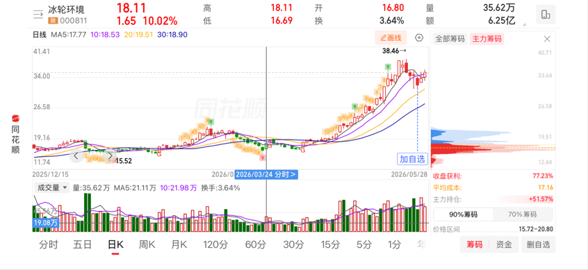
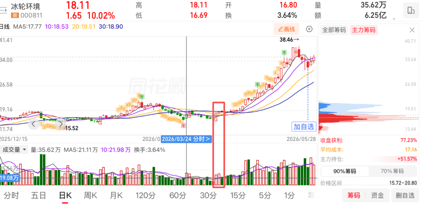
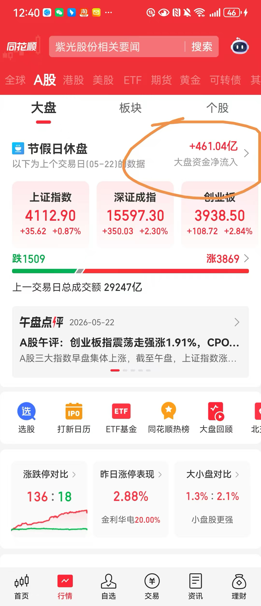
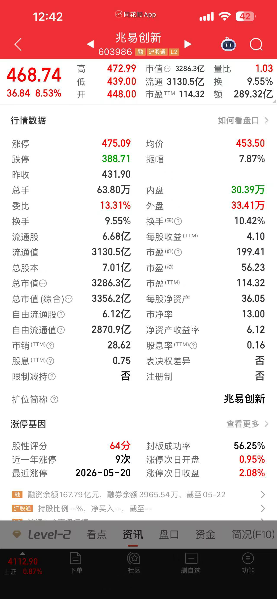
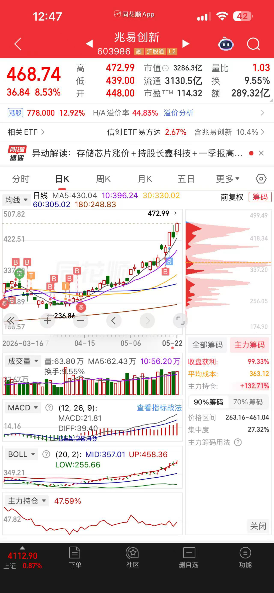
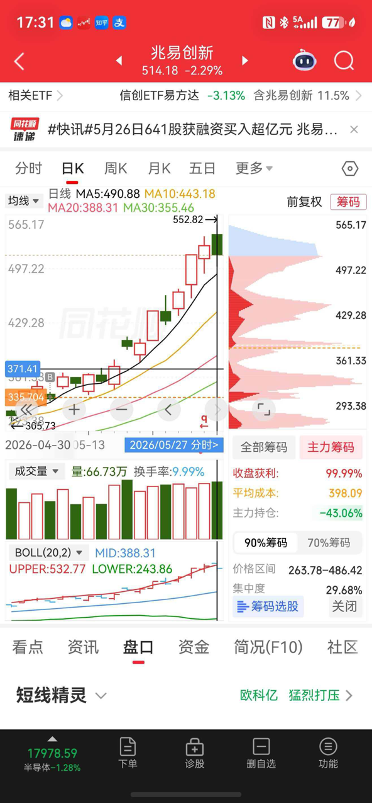
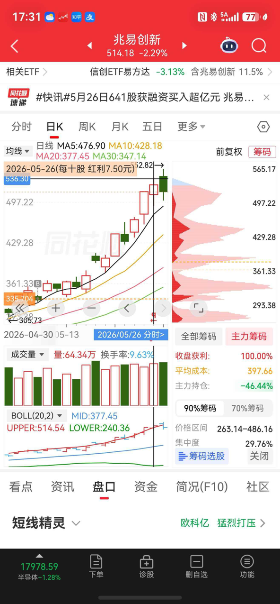
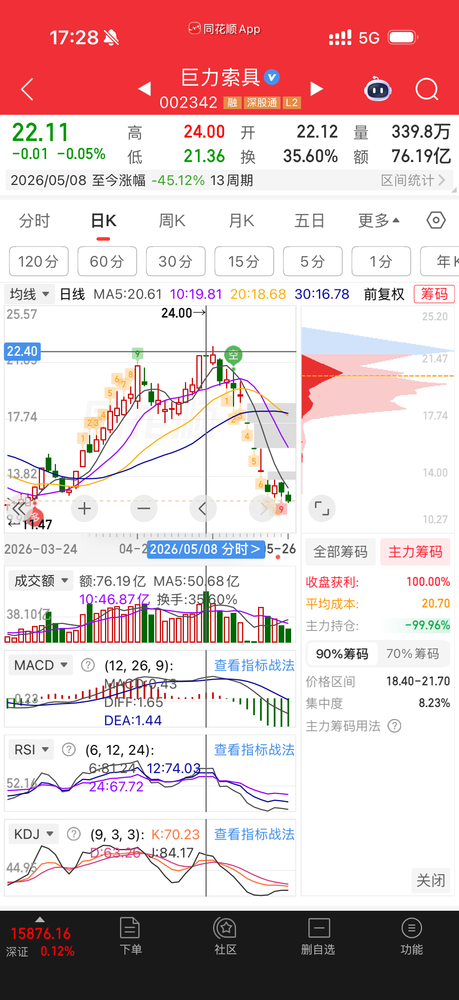
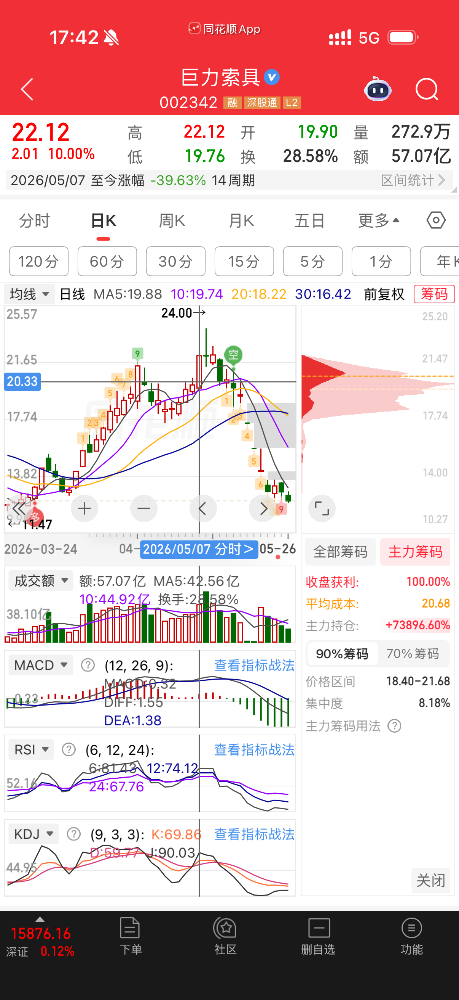

# 蛙蛙学习群文件分类整理

> 本文档整理自蛙蛙学习群8个文件，按主题分类，保留原话摘录。

---

## 一、宏观与国际形势

### 1.1 美伊战争与全球资本迁移

**核心观点：**
美伊战争揭露了美国军事空虚的本质，全球资本信心动摇，资本大迁移已经开始。

**原话摘录：**
> "美伊这场战争真的揭露了很多事，至少我们看清楚美国是真的实际上军事空虚。最可怕的不是他惹事，核心是他惹事他还平不了事，不光军事霸权被打穿了，而且甚至中东老爷们这才发现原来没有美国他们还不得被打，被打还根本保护不了自己。"
> 
> "所以其实美伊最大的结果就是，全球资本信心动摇，资本大迁移已经开始了。"

**美国霸权维持的原因：**
> "你们知道美国现在还维持霸权国的原因是什么吗？因为石油美元的绑定权，因为黄金的储备定价权，因为资本市场的全球虹吸效果。美国早就工业空虚了，他现在靠的就是科技军事的领先和由此带来的资本市场的定价能力。"

### 1.2 汇率市场的战争

**核心观点：**
汇率市场是第一战场，中国在美伊战争期间趁机"偷家"，秀肌肉给全球市场看。

**原话摘录：**
> "那一天开始之后的国际汇率市场特别好玩，我天天第一件事是看汇率市场，这才是第一战场。那时候正是大a调整的时候，但第一，大a确实需要调整了不然不健康，第二，其实资金都去第一战场了。"
> 
> "从那天开始，美元上窜下跳，离岸人民币，就是美元跟人民币的比例每天就差不多维持0.3个点左右的降幅，就是他涨我们也涨他跌我们也跌，嘿嘿嘿，就是压着这个线。"
> 
> "你说不是演的这谁信，这就是秀肌肉给全球市场看，我说我靠谱我就能靠谱。"

### 1.3 十五五规划解读

**核心观点：**
十五五当天新闻发布会开篇说了三件事：拒绝干涉内政、科技自主、中国是绝对靠谱的投资市场。

**原话摘录：**
> "十五五当天新闻发布会，其实国家开篇说了三件事：第一，拒绝干涉内政；第二，科技自主；第三，中国是绝对靠谱的投资市场。"
> 
> "看懂了吗？那一天开始，美伊在外面打，其实资本市场战争就开始了。"

### 1.4 外资唱空的真相

**核心观点：**
外资（特别是美国投研）唱空核心领域是因为害怕，代表我们真的要威胁到他们了。

**原话摘录：**
> "之前大摩为什么要下调兆易的目标价？他为什么你们真以为他是傻吗？他不是就是因为之前我跟你们讲的美伊打关税战，一打全球资本开始流动了，开始迁移了，不再把美股当成最可靠的市场了。"
> 
> "明明一群很聪明的就是你们看到的外资的投资机构，那帮券商比我们的券商精明多了，明明头脑很清醒的，他们就开始乱唱，哪个核心唱空，哪个平白无故地下调兆易的目标价，你们就没觉得奇怪吗？他们不是真的傻，是因为他们要尽一切努力地阻止我们达到我们的目的。这他妈是国际战。"
> 
> "就记得一件事，如果核心领域外资唱空就是因为他们害怕，代表我们真的要威胁到他们了。"

---

## 二、国家政策与市场机制

### 2.1 国家大基金的目的

**核心观点：**
国家大基金主要目的是给还在成长期、还没有能力的公司做保障，当公司具备造血能力后会逐步退出。

**原话摘录：**
> "国家大基金主要存在的目的是为了给还在成长期的，还没有能力的这样的公司做保障的，所以每一次当他们觉得这个公司已经到了自己可以造血，甚至生活得很好的时候，他们就会松手。"

### 2.2 社保保险入市的意义

**核心观点：**
社保保险入市是为了托市、托情绪、托指数，吸引外资进来，表态抢夺资本市场定价权。

**原话摘录：**
> "社保保险现在进市，从去年开始脱市，是因为大家现在还不具备自己的成熟能力，我们确实还在吸引外资，但是本身资本市场的流动性和信心和活跃度都是不够的，很容易就被就被美股带垮了。所以没办法，社保保险进来来做护市，来托情绪，来托指数，来让大A这个牛市可以维持下去。"
> 
> "这两年还是没办法，社保保险肯定还是要进来沪市，因为我们才刚刚开始抢夺资本市场的定价权。可是当外资开始重新认定，中国真的是一个他们觉得很有价值的，美国之二的第二大投资市场的时候，社保保险也会逐步退出的。"

### 2.3 股指期货的作用

**核心观点：**
中信股指期货存在的意义不是为了自己做对冲，而是国家队在表态做多，与做空机构在期货市场上对战。

**原话摘录：**
> "大A不允许做空，我再重复一遍，只有外资会来做空我们，我们不能自己做空自己。所以实际上中信股指期货这点儿量，它就是中国家队在表态，表态，我就是要做多，你们别给我捣乱，他是为了跟做空机构在期货市场上来做对战的，不是为了做自己的避险对冲的。"
> 
> "市场过热，空单压情绪；外资做空，多单保指数。"

### 2.4 集中减持的核心目的

**核心观点：**
集中减持是为了把核心赛道的资本定价权把握在自己手里，让真正能控制资本市场的人引进来做股东。

**原话摘录：**
> "集中减持，为的就是把核心赛道的资本定价权把握在自己手里。个人玩不动资本市场，那就国家资金来玩，这才是集中减持的核心目的，把真正能控制资本市场的人引进来做股东，这样我们才不怕别人搞事。"

### 2.5 大A与外资进入比例控制

**核心观点：**
大A有外资进入比例限制，超过不准入；港股才是吸引外资的第一市场。

**原话摘录：**
> "大a有外资进入比例的，超过了不准入。港股才是吸引外资的第一市场，大a其实控制很严。这才是我说大a太好赚钱的原因啊。"

---

## 三、行业研究方法

### 3.1 从工艺流程入手研究行业

**核心观点：**
研究一个行业，要看整个工艺是怎么一步步走下来的，这个过程都需要什么，抓住这些环节。

**原话摘录：**
> "你就去研究芯片制造的环节，研究工艺流程，看看这个环节里面什么是核心的基础耗用量最大的。"
> 
> "例如说芯片制造环节：首先他的底层材料是硅片，所有的工艺图都在硅片上刻画。刻画的过程需要光刻技术，光刻机作为缝纫机，但需要润滑剂，这就是光刻胶。他刻完了裸片不行啊，需要弄一个保护层，这就是封装。全过程都需要绝对的清洁度，需要清洗剂，这就是电子特气。"

**研究框架总结：**
> "国家趋势定板块，板块工业定核心细分环节，细分环节找龙头。"

### 3.2 红海与蓝海的演变

**核心观点：**
蓝海是新行业增长时供小于求的状态；红海是投机者涌入后供大于求、价格回落的状态。

**原话摘录：**
> "一开始出现了新的行业增长，因为新技术的出现或者因为政策导向，那个时候因为之前都没有这么好的赚钱效应，其实从业者不多，随着市场的暴增出现了蓝海效应。简单的说，供小于求，所有人都在抢货，于是开始涨价。"
> 
> "但是资本的本能是逐利，如果不控制行业的正常走势，接下来的效果就是有钱人都来了。接下来的结果就是我们熟悉的内卷，每个人都都在拼命建设投产，供大于求了，于是从乙方市场转为甲方市场，价格回落，开始反过来考验真正的技术和专业性。这就是红海。"

### 3.3 定价权逻辑

**核心观点：**
定价权的核心是技术主导性，但最核心的还是需求方。技术方有定价权的根本原因是因为下游有足够的市场想象空间。

**原话摘录：**
> "定价权的核心是技术主导性，但最核心的还是需求方。简单的说，再牛的东西没人就没用，所以最终的定价权其实还是在付款方手里。"
> 
> "为什么核心技术掌握方会有定价权，是因为下游市场确实在增长。你的客户知道能赚钱，上游又没得选，你最nb，所以他会跟你协商甚至妥协。"
> 
> "所谓的定价权也是在合理空间内的。健康的行业是每个人彼此留分寸，大家都能活得挺好。在这个基础上多点少点的，你说了算。"

### 3.4 技术壁垒与行业门槛

**核心观点：**
什么样的行业能变成红海，因为门槛太低。芯片半导体门槛高，不容易变成红海。

**原话摘录：**
> "什么样的行业能变成红海，因为门槛太低。为什么通信市场那么好，到现在做基站的中国也只有华为中兴，因为技术壁垒太高了。谁不知道赚钱，你进得去吗？芯片半导体也是一样的，你怎么进，那是人家几十年的攻关，你说进就进？有钱有毛线用。"

---

## 四、估值与财务分析

### 4.1 PE估值核心逻辑

**核心观点：**
PE适合成长股，代表投资回本年限。成长企业盈利高速增长，静态PE失效，仅看未来动态PE。

**原话摘录：**
> "pe是判断一个成长性企业最有用的指标。估值指标三种：pe、pb、ps，分别用来判断不同性质和发展状态的公司。"
> 
> "pe，简单的说，就是股价和净利润的比值。为什么这个对成长性企业最有用呢，因为他的价值在于创造利润的能力不断提升，他的资产在发挥远超于自身购置成本的能力。"
> 
> "对于快速成长期的企业来说，静态pe是没有什么用的。为什么呢？用兆易举例，他今年的业绩应该会是去年的3-4倍，明年估计会是今年的2-4倍的区间，市场增量迅速提升，收入和净利润不是静态增长的，所以静态pe一点用没有。"

**投资判断标准：**
> "投资判断标准：5-8年能否回本，超出则估值过高。举例中国卫星pe上千了，回本周期过长，因此不参与。"

### 4.2 半导体行业投资逻辑

**核心观点：**
芯片半导体是时代大趋势，国产替代空间至少5倍，景气周期至少延续3-5年。

**原话摘录：**
> "芯片半导体在我们和美国是不一样的估值逻辑。因为这是一个高增长且稳定增长的行业。你们想想现在的生活，新能源车、工业自动化、工业物联、机器人、商业航天、手机、智能家居，反正每一个地方不要芯片的。大趋势来说，我们早就进入了数据化时代，这是时代洪流。"
> 
> "国产化率到目前为止太低了，不光芯片半导体包括上游的各大环节，尤其是硅片和光刻。所以当我们能力具备之后，这就是至少5倍的市场，还只是我们自己。"
> 
> "国产替代第一步，第二步就是用成本卷死别人进攻全球。"

**逆周期打法：**
> "行业下行、外部技术封锁、资本收缩的低谷阶段，持续砸研发、扩产能、补齐技术短板；低谷期逆势沉淀产能与技术，等到行业景气回升、国产替代需求爆发，本土产品实现规模化量产，就可以打破外部垄断，从被动接受价格，变成参与甚至主导细分品类定价。"

### 4.3 兆易创新财报隐藏价值

**核心观点：**
兆易创新持有长鑫存储股份，通过特殊会计方式做账，刻意隐藏长鑫的盈利与市值增长。

**原话摘录：**
> "兆易的报表里面，从头到尾，你都看不见长鑫的影子。奇怪吗？长鑫一季度业绩上了天，真龙炸了全世界，但兆易的报表里面，没有投资收益就算了，还没有其他综合收益。"
> 
> "他做成了其他权益工具。其他权益工具和长投的差异就是，前者会把长鑫的利润对应比例算入投资收益直接增加当期净利润；其他权益工具的价值变动不进收入利润表。"
> 
> "在长鑫彻底站稳之前，都要保护她，那么多人想弄死他呢，美国不天天想干你？所以当我看到这个报表之后，我就彻底燃了，tm朱一明真是个英雄！"

### 4.4 会计处理差异：长投/其他权益工具/金融资产

**核心观点：**
三种入股做账方式，完全看企业持股目的，可自主选择。

**原话摘录：**
> "长投、其他权益工具、交易性金融资产，三种入股做账方式，完全看企业持股目的，可自主选择。"

| 类型 | 特点 | 利润影响 |
|-----|------|---------|
| 长期股权投资（深度参股） | 对方盈利按持股比例计入投资收益 | 归入净利润 |
| 其他权益工具投资（长线持有） | 仅分红、卖出时收益计入净利润 | 股价涨跌不进净利润 |
| 交易性金融资产（炒股属性） | 股价涨跌公允价值变动直接计入净利润 | 浮盈浮亏直接影响当期利润 |

**原话摘录：**
> "兆易持长鑫：定性战略长线→股价涨跌不影响净利润；中科仪持拓荆：定性财务炒股→股价涨跌直接影响净利润。"
> 
> "会计准则仅划定大分类，最终归类由上市公司自主判定。公司想美化利润，就划为交易性金融资产，靠股价波动增厚利润；想利润平稳，就划为其他权益工具，隔绝股价波动影响。全看公司做账的选择。"

---

## 五、技术分析与交易实操

### 5.1 右侧放量建仓方法

**核心观点：**
右侧成交量连续两天放量，第一天冲高回落，第二天低开高走，放量第二天尾盘介入。

**原话摘录：**
> "来学习，右侧，成交量连续两天都放量，并且一天冲高回落，一天低开高走，放量第二天尾盘介入，就可以耐心等待了。"
> 
> "但是，有一种情况，如果左侧没放过量，可能会是试盘拉伸，这个时候只适合轻建仓。例如国轩，两天放量追进去，洗盘回调能扛得住吗，15个点的亏损。"

### 5.2 洗盘识别

**核心观点：**
如果左侧放过量，股价拉伸20、30、50个点，但主力成本没有超过五十个点，并且回调股价高于左侧第一次启动时股价10个点以上，都认为是洗盘。

**原话摘录：**
> "如果是放量过，左侧股价拉伸20、30、50个点，但是主力成本没有超过五十个点，并且回调股价高于左侧第一次启动时股价10个点以上，都认为是洗盘。那么这时候第二次放量，连续两天，就可以介入了，可以第二天尾盘，也可以第三天，有的第三天继续上攻，有的第三天会技术性收十字星。"

### 5.3 量能分析

**核心观点：**
量能代表交易成本，放量就是绝对的好信号。高位放量一般不会放巨量。板块大成交量总不能是散户买的，量骗不了。

**原话摘录：**
> "量能代表交易量，而这个最重要的是，代表了交易成本。"
> 
> "放量就是绝对的好信号。买盘哪来的？什么流入流出，就问问自己一个问题，买盘是谁？？？"
> 
> "高位放量一般也不会放巨量。这就是有人急着抢筹故意造低位。"
> 
> "你想想，板块大成交量总不能是散户买的吧，哪来那么多钱，那那么多人买，除了狗大户还能有谁，流入流出能拆小单骗你，但量骗不了啊。"

### 5.4 对手盘逻辑

**核心观点：**
交易是对手盘，有买就有卖，不对等不成交。主力流入流出是最常见的控盘手法，十个数据九个演。

**原话摘录：**
> "有一个误区是你们特别容易被吓到的，这事其实我讲过很多遍。回到基本常识，交易是对手盘，记得吗？有买就有卖，不对等不成交。换句话说，在这个前提下，股市只能持续增加容量，没法减少。"
> 
> "主力流入流出是最常见的控盘手法。同花顺是怎么判断的呢？流入流出就是看买盘卖盘谁靠近谁。简单的说，买一50，本来卖一51，突然出现了卖盘50或者49，这就认定为流出了。"
> 
> "我很明确的跟你们讲，十个数据九个演。因为这太容易控盘了，就是他大手挂主卖，但其实买盘都是他自己设定的。看起来全部主卖，其实买家全是自己。"

### 5.5 画盘成本分析

**核心观点：**
通过量能计算交易成本，判断主力意图。疯狂下杀但量能稳定，说明是画盘。

**原话摘录：**
> "看看兆易这个图，他疯狂下杀那段时间，莫名其妙疯狂下杀，但是那段时间平均量能全在90亿左右。我们来算成本哈，交易是需要印花税和佣金的，印花税单向，佣金双向。这还没算资金成本，因为90亿的资金体量，对哪个大资金来说都不算小份额。这一周的画盘成本上大几千万，没有图谋他要干啥，这可都是刚性成本。"

### 5.6 齐头并进看60日线

**核心观点：**
齐头要看60日线是刚穿过，还是穿过调整了一波，还是已经和股价脱离有一定距离了。

**原话摘录：**
> "要看日k线齐头并进的。齐头要看60日线是刚穿过，还是穿过调整了一波，还是已经和股价脱离有一定距离了。右侧一定要比左侧量能高。"

### 5.7 异动判断方法

**核心观点：**
最近三天单股涨幅减去大盘涨幅，就是三天实际涨幅偏离值，够20%就异动。

**原话摘录：**
> "最近三天单股的涨幅，减去大盘的涨幅，就是三天实际涨幅偏离值，看够不够20%，够了就异动呗。"
> 
> "没啥意义，我们做价值投资的，不看一两天的。"

### 5.8 出货识别

**核心观点：**
真正的出货都是在拉升后期边拉边出，高位放量一般属于最后一击。出货对象包括散户、基金、协议接盘游资或机构。

**原话摘录：**
> "出货除了散户，还有基金，协议接盘游资，或者机构。"
> 
> "因为坦白地说，高位放量一般都属于最后一击了。真正的出货都是在拉升后期边拉边出。为了不让人害怕，都还是会拉升，但筹码不动，就用一点小浮筹勾引。"
> 
> "高位横盘不一定就是出货，得看公司基本面，有没有新的成长预期，这个就得分析了。就像利通电子，70那会横盘已经不低了，但是算力他是实打实有算力的，那就是洗盘，甚至还惜筹。"

**出货信号识别：**
> "第一流入流出不要看，买卖不要看。第二，以基本面支撑和位置综合判断可能性。第三，为什么让你们看主力筹码。低位建仓信号其实非常明确，建仓完成你们就可以帮他们算成本了。高位出货现在特别隐蔽，都知道我们要看，所以玩整体消减，不仔细看容易被迷惑。"

### 5.9 筹码分析技巧

**核心观点：**
突然出现主力一点都不参与的顶部筹码迅速增加，单筹码峰体积甚至创新高，这个时候就得警惕。

**原话摘录：**
> "看到了吗，顶部筹码虚浮，全是散户…而且这一波直接盖过了之前的所有筹码峰顶。大量散户接盘。"
> 
> "突然出现主力一点都不参与的顶部筹码迅速增加，单筹码峰体积甚至创新高…这个时候就得警惕。当然还是基本面打底，因为正常来说，主力也会这么玩，我们看筹码他们也在通过筹码玩弄我们。所以警惕就可以了，继续看。"
> 
> "如果第二天出现明显的筹码变化，有基本面做长期pe的评估支撑没到位趋势仓都可以留着，但波段仓可以准备撤了。要是我看到这种信号，只要不是基本面太强悍的，我都先准备撤波段，看第二天主力到底加仓不加仓。"

### 5.10 主力建仓规律

**核心观点：**
主力低位建仓后一般会有20%-30%的试盘，然后回落10%-15%继续洗盘吸筹，之后开始主升行情。试盘拉升虽然拉了20个点，但因庞大资金量和资金成本，这个时候主力是不赚钱的。

**原话摘录：**
> "机构建仓不是一两天，会有时间段，具体哪天拉伸要不看主力心情，要不看市场情绪。爱瑞特波浪理论你们可以学习，这个可以判断主力的目标价位。"
> 
> "一般主力建仓后会有试盘和拉伸两个波段，但是也不一定，强势的会一波到位，但是如果没有基本面支撑，也是摔下来最快的。主力低位建仓后一般会有20%-30%的试盘，然后会回落10-15%，继续洗盘吸筹，之后开始主升行情。"
> 
> "试盘的拉伸，虽然拉了20个点，但是因为庞大的资金量以及资金成本，这个时候他们是不赚钱的，所以这个时候洗盘最狠，最磨人。"

### 5.11 波段操作策略（50%关键点位）

**核心观点：**
主力一般在股价拉升50%左右开始有利润垫。股价和主力成本基本一致时可以列入观察。洗盘越狠说明主力志在高远。

**原话摘录：**
> "那么多少赚钱呢，一般是50%左右，这个时候就有利润垫了，记住50%这个比例。有主力筹码的可以看主力成本，一般情况下，股价和主力成本基本一致，股价略高于主力成本，这个时候就可以列入观察了。但是这个洗盘，谁也不知道洗多久，但一般情况下，洗的越狠，说明主力志在高远。"
> 
> "在股价拉伸50%左右的时候，如果主力实力不雄厚，这个时候主力成本是和股价差不多的。这波段就到顶了，该跑路就跑路。"
> 
> "如果股价到了，但是成本没到，这个时候选择就看主力心情，可能直接拉伸，也可能回调，一般回调是20个点左右，但是如果惜筹，最多10个点，例如兆易这波，根本不给别人机会捡筹码。也有洗的狠的，回调25个点。"

**第二次拉升的三个目标位：**
> "不论回调到位，还是不回调，第一次拉伸50个点以后主力成本不到预期，第二次拉伸盯紧主力成本有没有到第一个波段的50%。股价的话第二次拉伸有三个目标位需要注意，20%、30%、50%。这个时候主力随时可能回调，所以在底仓不动的情况下，除非兆易这种基本面无敌的，建议是在这三个位置各出一部分波段仓，在第二个50%的拉伸后，只留下底仓飞就可以了。"

**警惕出货信号：**
> "比如主力和股价建仓都是3块，第一个波段股价到了4.5，但是主力成本没到，这个时候哪天主力成本到了4.5，就要开始警惕。这个时候是警惕开始出货，如果我们是短线，公司基本面一般，这个时候就可以减仓了，不论今天是否涨停，都要跑一部分。"
> 
> "但是也有的时候情绪到了，成本还会继续涨，这个时候得看主力成本筹码的具体形态，就是蛙姐之前讲的那个。有的冲高就是吸引散户接盘的。如果基本面强悍，那即使成本到了，也会洗盘吸筹第二波拉伸。"

---

### 5.12 艾略特波浪理论应用

> **详细文档：** [艾略特波浪理论详解](./艾略特波浪理论详解.md)

**核心观点：**
> "爱瑞特波浪理论你们可以学习，这个可以判断主力的目标价位。"

**波浪与主力行为对应：**
| 波浪 | 主力行为 | 特征 |
|-----|---------|------|
| 浪1 | 建仓/试盘 | 拉升20%-30%，主力不赚钱 |
| 浪2 | 洗盘 | 回调10%-15%，洗得越狠志在高远 |
| 浪3 | 主升行情 | 最强一波，突破明显 |
| 浪4 | 整理休息 | 调整复杂，形态多样 |
| 浪5 | 出货阶段 | 最后冲刺，动能减弱 |

**三大铁律：**
1. 浪2不能跌破浪1起点（否则不是浪2，而是下跌趋势延续）
2. 浪3不能是最短的推动浪（否则波浪识别错误）
3. 浪4不能进入浪1价格区间（否则形态失败）

**斐波那契关键比例：**
- 浪2回撤浪1：50% 或 61.8%
- 浪3延伸浪1：1.618 或 2.618 倍
- 浪5等幅浪1：1.0 倍

**与50%关键点位的关系：**
- 第一次拉升50% ≈ 浪1完成
- 第二次拉升目标位 ≈ 斐波那契延伸比例
- 主力成本到达50%位置 ≈ 浪3主升开始

---

## 六、选股逻辑总结

**核心框架：**
1. 第一看国际形势（主战场在哪）
2. 第二看国家策略确定赛道
3. 第三选龙头
4. 第四选位置

**原话摘录：**
> "所以我选股，第一是看国际形势，看我们的主战场在哪；第二看国家策略确定赛道；第三选龙头；第四选位置。"
> 
> "只要方向对，不买杂毛概念股，一律不可能亏。哦对，追高是谁教你们的，下次再追高自己剁手。"

---

## 附录一：源文件列表

| 序号 | 文件名 | 主要内容 | 图片数量 |
|-----|--------|---------|---------|
| 1 | 小无哥实操干货.docx | 技术分析实操方法（右侧放量建仓、洗盘识别） | 2张 |
| 2 | 蛙蛙小课堂1.docx | 选股逻辑、国际形势、交易对手盘 | 3张 |
| 3 | 蛙蛙小课堂2.docx | PE估值、兆易创新投资逻辑、财报分析 | 无 |
| 4 | 蛙蛙小课堂3.docx | 会计处理差异（长投/其他权益工具/金融资产） | 无 |
| 5 | 蛙蛙小课堂4.docx | 行业研究方法（从工艺流程入手） | 无 |
| 6 | 蛙蛙小课堂5.docx | 国家大基金、社保保险、股指期货、外资唱空真相 | 2张 |
| 7 | 蛙蛙小课堂6.docx | 红海蓝海、定价权逻辑、行业门槛 | 无 |
| 8 | 无隅.docx | 异动判断、出货识别、筹码分析、主力建仓规律、波段操作策略（50%关键点位） | 2张 |

---

## 附录二：图片索引

### 小无哥实操干货图片

**图1：右侧放量建仓示意图**

**图2：洗盘识别示意图**

---

### 蛙蛙小课堂1图片

**图1：选股逻辑框架图**

**图2：国际形势与资本市场关系图**

**图3：对手盘逻辑示意图**

---

### 蛙蛙小课堂5图片

**图1：国家大基金运作机制图**

**图2：股指期货多空对战示意图**

---

### 无隅图片

**图1：筹码分析示意图**

**图2：主力建仓规律示意图**
