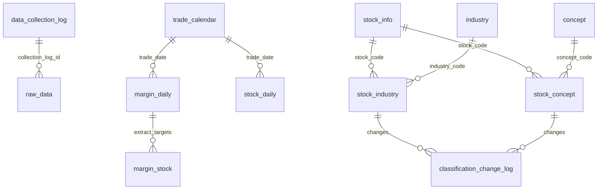

# 数据模型：数据采集层

**Feature**: 003-data-collection | **Date**: 2026-05-13

## ER 图



## 实体定义

### 1. data_collection_log（采集日志）

| 字段 | 类型 | 约束 | 说明 |
|------|------|------|------|
| id | bigint | PK AUTO_INCREMENT | |
| data_type | varchar(30) | NOT NULL | STOCK_INFO / STOCK_DAILY / TRADE_CALENDAR / INDUSTRY_NAME / INDUSTRY_CONS / CONCEPT_NAME / CONCEPT_CONS / MARGIN_DAILY_SSE / MARGIN_DAILY_SZSE |
| job_type | varchar(10) | NOT NULL | FETCH / CLEANSE |
| status | varchar(15) | NOT NULL | PENDING → RUNNING → SUCCESS / FAILED |
| trade_date | date | NULLABLE | 关联交易日，非日期维度数据为 null |
| week_start | date | NULLABLE | 按周回填起始 |
| week_end | date | NULLABLE | 按周回填结束 |
| record_count | int | NULLABLE | 采集/清洗记录数 |
| error_msg | text | NULLABLE | 失败原因 |
| started_at | datetime | NULLABLE | 开始时间 |
| completed_at | datetime | NULLABLE | 完成时间 |
| created_at | datetime | NOT NULL DEFAULT NOW() | |

**索引**: `INDEX idx_log_type_date (data_type, trade_date)`

**生命周期**: PENDING → RUNNING → SUCCESS（正常）/ FAILED（重试 3 次后）

---

### 2. raw_data（原始数据）

| 字段 | 类型 | 约束 | 说明 |
|------|------|------|------|
| id | bigint | PK AUTO_INCREMENT | |
| collection_log_id | bigint | FK → data_collection_log.id | 关联 FETCH 日志 |
| data_type | varchar(30) | NOT NULL | 同 data_collection_log.data_type |
| trade_date | date | NULLABLE | |
| source | varchar(20) | NOT NULL DEFAULT 'AKSHARE' | |
| raw_json | longtext | NOT NULL | 原始 JSON |
| fetch_at | datetime | NOT NULL | 采集时间 |
| created_at | datetime | NOT NULL DEFAULT NOW() | |

**索引**: `INDEX idx_raw_log (collection_log_id)`

**清理**: 保留 30 天，超期 GZIP 归档后物理删除

---

### 3. trade_calendar（交易日历）

| 字段 | 类型 | 约束 | 说明 |
|------|------|------|------|
| id | bigint | PK AUTO_INCREMENT | |
| trade_date | date | UNIQUE NOT NULL | 交易日日期 |
| is_trading_day | tinyint | NOT NULL DEFAULT 1 | |
| created_at | datetime | NOT NULL | |
| updated_at | datetime | NULLABLE | |
| is_deleted | tinyint(1) | NOT NULL DEFAULT 0 | |

**数据来源**: `tool_trade_date_hist_sina`，首次全量写入，后续增量对比新增

---

### 4. stock_info（股票基础信息快照）

| 字段 | 类型 | 约束 | 说明 |
|------|------|------|------|
| id | bigint | PK AUTO_INCREMENT | |
| code | varchar(10) | NOT NULL | 股票代码 |
| name | varchar(20) | NOT NULL | 股票名称 |
| latest_price | decimal(10,3) | NULLABLE | 最新价（元） |
| change_pct | decimal(6,2) | NULLABLE | 涨跌幅 % |
| change_amount | decimal(8,3) | NULLABLE | 涨跌额（元） |
| volume | bigint | NULLABLE | 成交量（手） |
| amount | decimal(16,2) | NULLABLE | 成交额（元） |
| turnover_rate | decimal(6,2) | NULLABLE | 换手率 % |
| volume_ratio | decimal(6,2) | NULLABLE | 量比 |
| pe | decimal(10,3) | NULLABLE | 动态市盈率 |
| pb | decimal(10,3) | NULLABLE | 市净率 |
| total_mv | decimal(14,2) | NULLABLE | 总市值（元） |
| float_mv | decimal(14,2) | NULLABLE | 流通市值（元） |
| snapshot_date | date | NOT NULL | 快照日期 |
| created_at | datetime | NOT NULL | |
| updated_at | datetime | NULLABLE | |
| is_deleted | tinyint(1) | NOT NULL DEFAULT 0 | |

**唯一键**: `(code, snapshot_date)`  
**索引**: `INDEX idx_code (code)`, `INDEX idx_snapshot (snapshot_date)`  
**数据来源**: `stock_zh_a_spot_em`

---

### 5. stock_daily（股票日线行情）

| 字段 | 类型 | 约束 | 说明 |
|------|------|------|------|
| id | bigint | PK AUTO_INCREMENT | |
| stock_code | varchar(10) | NOT NULL | |
| trade_date | date | NOT NULL | |
| open | decimal(10,3) | NULLABLE | 开盘价 |
| high | decimal(10,3) | NULLABLE | 最高价 |
| low | decimal(10,3) | NULLABLE | 最低价 |
| close | decimal(10,3) | NULLABLE | 收盘价（前复权 qfq） |
| volume | bigint | NULLABLE | 成交量（手） |
| amount | decimal(16,2) | NULLABLE | 成交额 |
| created_at | datetime | NOT NULL | |
| updated_at | datetime | NULLABLE | |
| is_deleted | tinyint(1) | NOT NULL DEFAULT 0 | |

**唯一键**: `(stock_code, trade_date)`  
**索引**: `INDEX idx_code_date (stock_code, trade_date)`  
**数据来源**: 首次回填 `stock_zh_a_hist`，日常增量 `stock_zh_a_spot_em` OHLC 提取

---

### 6. industry（行业板块定义）

| 字段 | 类型 | 约束 | 说明 |
|------|------|------|------|
| id | bigint | PK AUTO_INCREMENT | |
| code | varchar(10) | UNIQUE NOT NULL | 板块代码 BK0740 |
| name | varchar(50) | NOT NULL | 行业名称 |
| created_at | datetime | NOT NULL | |
| updated_at | datetime | NULLABLE | |
| is_deleted | tinyint(1) | NOT NULL DEFAULT 0 | |

**数据来源**: `stock_board_industry_name_em`

---

### 7. stock_industry（股票-行业关联，仅保留最新）

| 字段 | 类型 | 约束 | 说明 |
|------|------|------|------|
| id | bigint | PK AUTO_INCREMENT | |
| stock_code | varchar(10) | NOT NULL | |
| industry_code | varchar(10) | NOT NULL | |
| snap_date | date | NOT NULL | 最近快照日期 |
| created_at | datetime | NOT NULL | |
| updated_at | datetime | NULLABLE | |
| is_deleted | tinyint(1) | NOT NULL DEFAULT 0 | |

**唯一键**: `(stock_code, industry_code)` — 一票一行业（东方财富单分类）  
**索引**: `INDEX idx_industry (industry_code)`  
**数据来源**: `stock_board_industry_cons_em`

---

### 8. concept（概念板块定义）

| 字段 | 类型 | 约束 | 说明 |
|------|------|------|------|
| id | bigint | PK AUTO_INCREMENT | |
| code | varchar(10) | UNIQUE NOT NULL | 板块代码 |
| name | varchar(50) | NOT NULL | 概念名称 |
| created_at | datetime | NOT NULL | |
| updated_at | datetime | NULLABLE | |
| is_deleted | tinyint(1) | NOT NULL DEFAULT 0 | |

**数据来源**: `stock_board_concept_name_em`

---

### 9. stock_concept（股票-概念关联，仅保留最新）

| 字段 | 类型 | 约束 | 说明 |
|------|------|------|------|
| id | bigint | PK AUTO_INCREMENT | |
| stock_code | varchar(10) | NOT NULL | |
| concept_code | varchar(10) | NOT NULL | |
| snap_date | date | NOT NULL | 最近快照日期 |
| created_at | datetime | NOT NULL | |
| updated_at | datetime | NULLABLE | |
| is_deleted | tinyint(1) | NOT NULL DEFAULT 0 | |

**唯一键**: `(stock_code, concept_code)` — 一票多概念  
**索引**: `INDEX idx_concept (concept_code)`  
**数据来源**: `stock_board_concept_cons_em`

---

### 10. classification_change_log（分类变更日志）

| 字段 | 类型 | 约束 | 说明 |
|------|------|------|------|
| id | bigint | PK AUTO_INCREMENT | |
| stock_code | varchar(10) | NOT NULL | |
| classification_type | varchar(10) | NOT NULL | INDUSTRY / CONCEPT |
| sector_code | varchar(10) | NOT NULL | 板块代码 |
| action | varchar(10) | NOT NULL | ADD / REMOVE |
| snap_date | date | NOT NULL | 变更发现日期 |
| created_at | datetime | NOT NULL DEFAULT NOW() | |

**索引**: `INDEX idx_stock_type_date (stock_code, classification_type, snap_date)`

---

### 11. margin_stock（两融标的）

| 字段 | 类型 | 约束 | 说明 |
|------|------|------|------|
| id | bigint | PK AUTO_INCREMENT | |
| stock_code | varchar(10) | NOT NULL | |
| stock_name | varchar(20) | NOT NULL | |
| exchange | varchar(4) | NOT NULL | SSE / SZSE |
| is_margin | tinyint | NOT NULL DEFAULT 0 | 是否融资标的 |
| is_short | tinyint | NOT NULL DEFAULT 0 | 是否融券标的 |
| snap_date | date | NOT NULL | 快照日期 |
| created_at | datetime | NOT NULL | |
| updated_at | datetime | NULLABLE | |
| is_deleted | tinyint(1) | NOT NULL DEFAULT 0 | |

**唯一键**: `(stock_code, snap_date)`  
**索引**: `INDEX idx_exchange (exchange)`  
**数据来源**: `margin_daily` CLEANSE 时提取新出现的 stock_code

---

### 12. margin_daily（两融交易明细 — 核心业务表）

| 字段 | 类型 | 约束 | 说明 |
|------|------|------|------|
| id | bigint | PK AUTO_INCREMENT | |
| stock_code | varchar(10) | NOT NULL | |
| trade_date | date | NOT NULL | |
| exchange | varchar(4) | NOT NULL | SSE / SZSE |
| margin_balance | decimal(16,2) | NULLABLE | 融资余额 |
| margin_buy | decimal(16,2) | NULLABLE | 融资买入额 |
| margin_repay | decimal(16,2) | NULLABLE | 融资偿还额 |
| short_balance | decimal(16,2) | NULLABLE | 融券余额 |
| short_sell_vol | bigint | NULLABLE | 融券卖出量 |
| short_repay_vol | bigint | NULLABLE | 融券偿还量 |
| short_remain_vol | bigint | NULLABLE | 融券余量 |
| total_balance | decimal(16,2) | NULLABLE | 融资融券余额 |
| created_at | datetime | NOT NULL | |
| updated_at | datetime | NULLABLE | |
| is_deleted | tinyint(1) | NOT NULL DEFAULT 0 | |

**唯一键**: `(stock_code, trade_date, exchange)`  
**索引**: `INDEX idx_trade_date_exchange (trade_date, exchange)`, `INDEX idx_stock_date (stock_code, trade_date)`  
**数据来源**: `stock_margin_detail_sse(date)` + `stock_margin_detail_szse(date)`

---

## 状态机

### data_collection_log 生命周期

```
PENDING ──→ RUNNING ──→ SUCCESS
                │
                └──→ FAILED ──(manual retrigger)──→ PENDING
```

### 采集流程

```
定时/手动触发
    │
    ▼
PENDING (FETCH log created)
    │
    ▼
RUNNING (AKToolsClient.fetchXxx())
    │
    ├─── SUCCESS → raw_data INSERT → CLEANSE 自动触发
    │
    └─── FAILED → 重试 (2s/4s/8s) → 3 次仍失败 → FAILED + error_msg
                                            │
                                    PENDING (CLEANSE log created)
                                            │
                                            ▼
                                    RUNNING (@Transactional)
                                            │
                                    ├─── SUCCESS → 业务表写入
                                            │
                                    └─── FAILED → error_msg, 事务回滚
```
